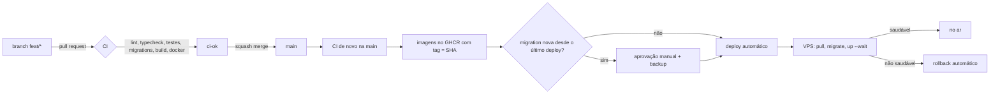

# CI/CD

Este documento descreve como o código do Atlas Stock sai de uma branch e chega em produção, e explica cada decisão do caminho.

## Visão geral

## Fluxo de trabalho

- `main` é a única branch fixa e está sempre publicável. O ruleset (`.github/rulesets/main.json`) bloqueia push direto e exige pull request.
- Cada mudança nasce numa branch curta (`feat/...`, `fix/...`) e entra por PR com **squash merge**. O título do PR segue Conventional Commits (`feat(compras): ...`) e vira o commit na `main`.
- O merge só é liberado com os checks `ci-ok` e `pr-title` verdes e com a branch atualizada em relação à `main`.

## CI (`.github/workflows/ci.yml`)

Roda em todo PR e de novo na `main`, antes de qualquer deploy. O Node vem do `.nvmrc` (24, a mesma major das imagens).

| Job | O que garante |
|---|---|
| `api` | Em `backend/`: `npm ci`, `prisma generate`, `lint:check`, `typecheck`, testes (vitest), build e `npm audit` (bloqueia só vulnerabilidade crítica de produção). Num **MySQL 8.4 real** (service container), aplica todas as migrations do zero e confere se `schema.prisma` e migrations estão em sincronia. |
| `web` | Em `frontend/`: `lint:check`, `typecheck`, testes, build e `npm audit` (high). |
| `docker` | As imagens `api` (target `runtime`), `migrate` e `web` buildam. Nada é publicado a partir de PR. |
| `workflows` | actionlint, zizmor (segurança dos workflows), shellcheck de `deploy/` e `scripts/`, e validação do `deploy/compose.prod.yml`. |
| `ci-ok` | Agregador. É o único check de CI exigido pelo ruleset. |

## CD (`.github/workflows/cd.yml`)

1. **Build uma vez, publica a mesma imagem.** As imagens `ghcr.io/bevilacquajulio/atlas_stock/{api,migrate,web}` são construídas no runner do GitHub com tag igual ao SHA do commit. A VPS não compila nada e não usa `git`: só baixa as imagens.
2. **Gate de migration.** O commit novo é comparado com o **último deploy bem-sucedido**. Se houver mudança em `backend/prisma/migrations/` nesse intervalo, o deploy vai para o environment `production-db`, que exige aprovação manual e faz backup do banco antes. Sem migration, vai direto para `production`.
3. **Deploy por SSH.** O CI entra como `deploy` e executa `/home/deploy/bin/deploy.sh bl_atlas_stock deploy <sha>`. O script valida o SHA, baixa as imagens, faz o backup (quando há migration), roda `prisma migrate deploy`, sobe a nova versão e espera o healthcheck.
4. **Rollback automático.** Se a nova versão não ficar saudável em 180 s, o script volta para a imagem anterior. Também existe o workflow manual `Rollback`.
5. **Health check público.** Depois do deploy, o runner chama `APP_URL` + `/api/health` para confirmar que Traefik, DNS e TLS respondem.

Um merge que muda só documentação (`*.md`, `docs/`) não publica nada.

## Arquitetura em produção

- O front chama a API por caminho **relativo** (`/api`). O Traefik roteia `Host(DOMAIN) && PathPrefix(/api)` para a API e o resto para o front, e mantém o subdomínio `api.DOMAIN` por compatibilidade. Por isso a imagem do front não carrega URL nenhuma.
- O login demo (`VITE_DEMO_ADMIN_*`) é opcional e vem das variáveis de repositório de mesmo nome. Ele fica embutido no JS público, então use só uma conta sem privilégios. Sem as variáveis, o botão fica oculto.
- MySQL compartilhado (`mysql_shared`) com TLS: a CA fica em `secrets/mysql-ca.pem` na pasta do projeto na VPS.

### Na VPS (`/home/juliobevi/htdocs/bevilabs/bl_atlas_stock/`)

| Arquivo | Conteúdo |
|---|---|
| `compose.yml` | Cópia de `deploy/compose.prod.yml` |
| `.env` | `DOMAIN`, `TRAEFIK_ENTRYPOINT`, `TRAEFIK_CERT_RESOLVER`. A linha `IMAGE_TAG` é gerenciada pelo `deploy.sh` |
| `.env.production` | Variáveis da aplicação (`MYSQL_*`, `JWT_*`, `CORS_ORIGIN`, `THROTTLE_*`), com `chmod 600` |
| `.env.backup` | `DB_NAME`, `DB_USER`, `DB_PASSWORD` para o dump (`chmod 600`) |
| `hooks/pre-migrate.sh` | Cópia de `deploy/hooks/pre-migrate.sh` |
| `secrets/mysql-ca.pem` | CA do MySQL |

### No GitHub

| Onde | Nome |
|---|---|
| Secrets dos environments `production` e `production-db` | `VPS_SSH_KEY`, `VPS_KNOWN_HOSTS`, `VPS_HOST`, `VPS_USER`, `VPS_PORT` (se não for 22) |
| (a chave em `VPS_SSH_KEY` é a mesma já autorizada no `authorized_keys` do `deploy`) | |
| Variáveis do repositório | `APP_URL` (obrigatória), `HEALTH_PATH` (padrão `/api/health`), `VITE_DEMO_ADMIN_EMAIL` e `VITE_DEMO_ADMIN_PASSWORD` (opcionais) |

Os segredos da aplicação ficam só na VPS. O GitHub não conhece nenhum deles.

## Migrations

- Toda mudança no `schema.prisma` vem com a migration no mesmo PR (`npx prisma migrate dev --name <nome>`). A CI barra se faltar.
- Uma migration já mergeada nunca é editada.
- Migrations precisam ser **retrocompatíveis** (expand/contract): o rollback troca a imagem, mas não desfaz o schema.
- O MySQL não tem DDL transacional, então uma migration que falha no meio deixa aplicado o que já rodou. Por isso as migrations são pequenas e há backup antes.

## Segurança

- Actions fixadas por SHA (o Dependabot atualiza), permissões mínimas por job e nenhum `pull_request_target`.
- Os secrets de produção ficam em environments restritos à `main`, então um workflow alterado numa branch não consegue lê-los.
- A chave SSH do CI é a do usuário `deploy`, compartilhada com outros projetos e **sem forced command**: quem tiver essa chave tem shell como `deploy` (grupo `docker`, equivalente a root). Endurecimento recomendado: uma chave por projeto com `command="/home/deploy/bin/deploy.sh bl_atlas_stock",restrict` no `authorized_keys` — o `deploy.sh` já aceita esse modo sem mudança. Mudanças em `deploy/` são aplicadas manualmente na VPS **antes** do merge.
- Os logs do Actions são públicos: o `deploy.sh` nunca imprime variáveis de ambiente nem logs da aplicação.
- As imagens rodam sem root (`USER node` e `nginx-unprivileged` na porta 8080).

## Decisões e trade-offs

| Decisão | Alternativa descartada | Motivo |
|---|---|---|
| GitHub Flow, só `main` fixa | GitFlow | Deploy contínuo com uma branch publicável é mais simples. |
| Sem homologação | `staging` na mesma VPS | A VPS tem recursos limitados. A cobertura vem de CI com MySQL real, healthcheck, rollback e gate de migration. |
| Build no runner + GHCR | `git pull && docker compose build` na VPS (modelo anterior) | Build reproduzível, rastreável pelo SHA e sem consumir CPU da produção. |
| SSH como `deploy` (chave compartilhada) | Self-hosted runner | Um runner self-hosted em repo público executaria código de PRs de terceiros na VPS. |
| API em `/api` relativo | URL absoluta `api.DOMAIN` no build | A mesma imagem serve qualquer domínio, sem CORS entre front e API. |
| 0 aprovações obrigatórias no PR | 1 aprovação | Projeto solo: o autor não pode aprovar o próprio PR. |
| Downtime de segundos no `up -d` | Blue/green | Aceitável para o porte do projeto. |

## Limitações conhecidas

- O `up -d` recria os containers, então há alguns segundos de 502 no Traefik.
- O backup fica na mesma VPS: protege contra uma migration ruim, não contra perder a VPS.
- `GET /api/health/ready` responde 200 mesmo com o banco fora (`database: "down"`). O pipeline usa `/api/health` (liveness).

## Operação

- Ver o que está no ar: aba **Deployments** do repositório, ou `.deploy-history` na pasta do projeto na VPS.
- Voltar uma versão: Actions → **Rollback** → informe o SHA. Se houver migration criada depois desse SHA, o workflow lista quais são e só segue com `confirm_schema_compat` marcado.
- Republicar a `main` (por exemplo, depois de sincronizar o compose): Actions → **CD** → *Run workflow*.
- Build local/manual sem o pipeline: `docker-compose.yml` na raiz (`docker compose up -d --build`).
